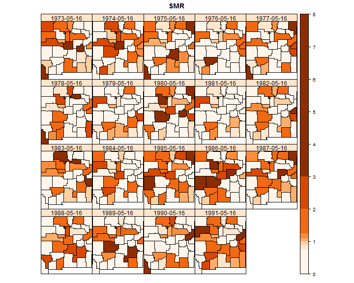

Disease Mapping with R
====================================


```r
### R code from vignette source 'st_dismap.Rnw'

####### code chunk number 1: st_dismap.Rnw:4-5
library(xts)
```

```
## Loading required package: zoo
## 
## Attaching package: 'zoo'
## 
## The following objects are masked from 'package:base':
## 
##     as.Date, as.Date.numeric
```

```r


####### code chunk number 2: st_dismap.Rnw:35-69
library(sp)
library(spacetime)
load("datasets/brain.RData")

# Los Alamos National Laboratory (source Wikipedia)
losalamos <- SpatialPoints(matrix(c(-106.298333, 35.881667), ncol = 2))

# Inverse distance to the laboratory
nmf$IDLANL <- 1/spDistsN1(coordinates(nmf), coordinates(losalamos), longlat = TRUE)
nmf$IDLANLre <- nmf$IDLANL/mean(nmf$IDLANL)  #Re-scale inverse distance

idx <- paste("Observed", 73:91, sep = "")
d <- data.frame(Observed = matrix(as.matrix(nmf@data[idx]), ncol = 1))

idx <- paste("Expected", 73:91, sep = "")
d$Expected <- matrix(as.matrix(nmf@data[idx]), ncol = 1)

idx <- paste("SMR", 73:91, sep = "")
d$SMR <- matrix(as.matrix(nmf@data[idx]), ncol = 1)

d$Year <- rep(1973:1991, each = nrow(nmf))

d$FIPS <- rep(nmf$FIPS, length(73:91))

d$ID <- as.numeric(rep(as.character(1:nrow(nmf)), length(73:91)))

d$IDLANL <- rep(nmf$IDLANL, length(73:91))
d$IDLANLre <- rep(nmf$IDLANLre, length(73:91))

times <- as.Date(as.character(1973:1991), format = "%Y")
brainst <- STFDF(as(nmf, "SpatialPolygons"), times, d)
```


```r
####### code chunk number 3: st_dismap.Rnw:85-92
library(RColorBrewer)

# print(stplot(brainst[,,'SMR'], cuts=7, col.regions=brewer.pal(8,
# 'Oranges')) )

print(stplot(brainst[, , "SMR"], at = c(0, 0.75, 0.9, 1, 1.1, 1.25, 2, 3, 8), 
    col.regions = brewer.pal(8, "Oranges")))
```

 

```r


####### code chunk number 4: st_dismap.Rnw:103-113
obs <- xts(brainst@data$Observed, as.Date(as.character(brainst@data$Year), format = "%Y"))
expt <- xts(brainst@data$Expected, as.Date(as.character(brainst@data$Year), 
    format = "%Y"))

obsy <- apply.yearly(obs, sum)
expty <- apply.yearly(expt, sum)
smry <- obsy/expty

plot(smry, main = "Standardised Mortality Ratio by Year")
```

 

```r


####### code chunk number 5: st_dismap.Rnw:154-172
library(spdep)
```

```
## Loading required package: Matrix
```

```r
neib <- poly2nb(nmf)
nb2INLA("results/nmf.adj", neib)
```

### Fitting spatio-temporal model with INLA

```r


library(INLA)
```

```
## Loading required package: splines
```

```r
#form<-NTORN~1+AREA+f(YEAR, model="rw2")+f(STATE, model="iid")+f(STATEID, model="besag", graph.file="statesth.adj")
form<-Observed~1+IDLANLre+f(Year, model="rw1")+f(ID, model="besag", 
   graph="results/nmf.adj")

inlares<-inla(form, family="Poisson", data=as.data.frame(brainst), 
   E=Expected,
control.predictor=list(compute=TRUE),
#   quantiles=qnts,
   control.results=list(return.marginals.predictor=TRUE)
)


#######
### code chunk number 6: st_dismap.Rnw:183-184
#######
summary(inlares)
```

```
## 
## Call:
## c("inla(formula = form, family = \"Poisson\", data = as.data.frame(brainst), ",  "    E = Expected, control.predictor = list(compute = TRUE), control.results = list(return.marginals.predictor = TRUE))" )
## 
## Time used:
##  Pre-processing    Running inla Post-processing           Total 
##          0.9501          2.6091          0.7250          4.2842 
## 
## Fixed effects:
##                mean     sd 0.025quant 0.5quant 0.975quant    mode kld
## (Intercept) -0.0090 0.0303    -0.0689  -0.0088     0.0499 -0.0084   0
## IDLANLre     0.0085 0.0092    -0.0106   0.0088     0.0256  0.0096   0
## 
## Random effects:
## Name	  Model
##  Year   RW1 model 
## ID   Besags ICAR model 
## 
## Model hyperparameters:
##                    mean     sd       0.025quant 0.5quant 0.975quant
## Precision for Year  8605.04 10596.17   119.81    4792.94 37376.06  
## Precision for ID   17406.66 17851.77   973.32   12005.11 64664.81  
##                    mode    
## Precision for Year   109.20
## Precision for ID    2495.33
## 
## Expected number of effective parameters(std dev): 2.697(0.8527)
## Number of equivalent replicates : 225.40 
## 
## Marginal Likelihood:  -823.89 
## Posterior marginals for linear predictor and fitted values computed
```

```r


#######
### code chunk number 7: st_dismap.Rnw:194-201
#######
plot(inlares, 
 plot.lincomb = FALSE,
                  plot.random.effects = FALSE,
                  plot.hyperparameters = FALSE,
                  plot.predictor = FALSE,
                  plot.q = FALSE,
                  plot.cpo = FALSE)
```


```{r fig.width=10, fig.height=8}#######
### code chunk number 8: st_dismap.Rnw:216-223
#######

plot(1973:1991, inlares$summary.random$Year[,2], type="l", lwd=1.5,
main="YEAR (with credible intervals)", ylim=c(-.1, .1), xlab="Year" )

lines(1973:1991, inlares$summary.random$Year[,4], lty=2)
lines(1973:1991, inlares$summary.random$Year[,6], lty=2)


#######
### code chunk number 9: st_dismap.Rnw:233-245
#######


spl<-list(list("sp.points", losalamos, pch=19, col="red"),
   list("sp.text", coordinates(losalamos), "Los Alamos National Laboratory", pos=1, col="red"))

library(RColorBrewer)
nmf$CAR<-inlares$summary.random$ID[,2]

print(spplot(nmf, c("CAR"), cuts=6, col.regions=brewer.pal(7, "BrBG"),
   sp.layout=spl))


#######
### code chunk number 10: st_dismap.Rnw:256-264
#######
form2<-Observed~1+f(Year, model="rw1")+f(ID, model="besag", graph="results/nmf.adj")

inlares2<-inla(form2, family="Poisson", data=as.data.frame(brainst),
   E=Expected,
control.predictor=list(compute=TRUE),
#   quantiles=qnts,
   control.results=list(return.marginals.predictor=TRUE)
)


#######
### code chunk number 11: st_dismap.Rnw:269-274
#######
nmf$CAR2<-inlares2$summary.random$ID[,2]

print(spplot(nmf, c("CAR2"), cuts=6, col.regions=brewer.pal(7, "BrBG"),
   sp.layout=spl))


```

